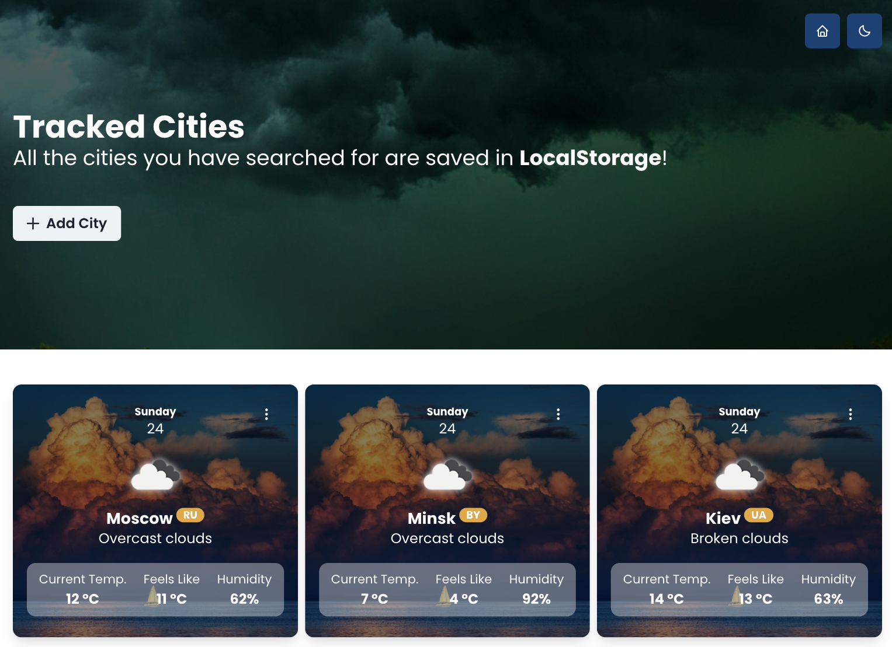

<h1 align="center">React Weather App</h1>

This repository contain a <strong>React</strong> project using the <strong>Open Weather Map</strong> API.

This project are created to a self-training.
 

